The iDigBio Search Records page is split into three main sections: the search form, the map, and the results table. 

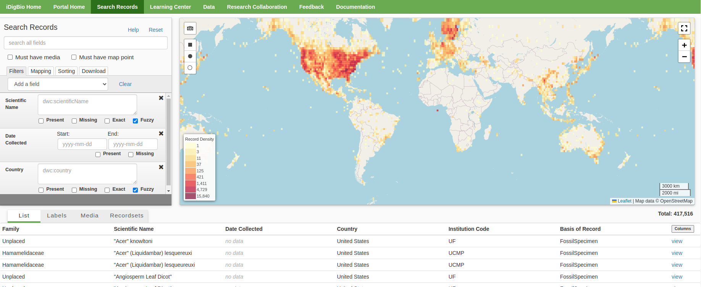

## Using the Search Form

The search form section of the Search Records page provides all fields necessary for doing full text and advanced searching across iDigBio data.  

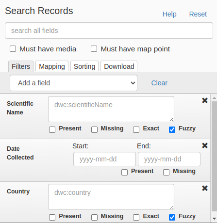

### Search all
The top of the search form is referred to as the **Search All** section.  

The **search all fields** text box allows you to search a term across all fields of the data simultaneously.
If you search for ‘carex’, this term is searched in all fields, and the search returns records where ‘carex’ appears in a scientific name, genus, host, locality, or any other place where it appears, excluding substrings (parts of words).
Searches are not case-sensitive, i.e., ‘carex’ and ‘Carex’ will return the same result.  

Checkbox reference:

- **Must have media** restricts mapped and record results to those specimens that have related images and other media.
- **Must have map point** restricts the record results section to show only records that contain geopoint data (mapping results can contain only records with geopoint data).

The **Help** link will open a modal with some tips to aid you in your search.  
The **Reset** link will clear your current search criteria, filters, and sorting rules and return the interface to default settings. 

### Filters tab
The **Filters** tab allows you to perform fuzzy match, exact text match, and range searches for data fields. 
Scientific Name, Date Collected, and Country are the default filters.  

To add a field, select **Add a field** and choose an option from the dropdown menu. Select **Clear** to restore the default filters.
Select the X icon in the upper right to remove individual filters.

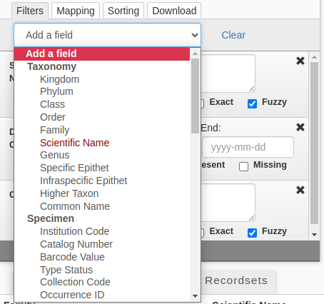

!!! note "A list of available fields and their meaning can be found [here](#)."

#### Autocomplete Suggestions

When performing a _Scientific Name_ search you will receive a dropdown menu containing suggestions and a count of records that are an **exact** match.
Selecting an option from the dropdown will autocomplete your input. 
You are not obligated to select an option - press the **enter** key on your keyboard to close the dropdown and search your text as is.  

 <h5> How is the suggestions dropdown populated? </h5>

Your query is re-evaluated with every keystroke. The autocomplete dropdown is populated with the top 10 scientific names contained in
your query’s result set by count. In other words - items contained in the dropdown are also contained in the result set at the bottom of the page. 

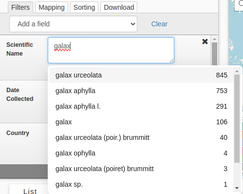  

!!! warning "Note that autocomplete is currently available for _Scientific Name_ only."

#### Default Search 

Default Search refers to a search where no checkboxes are selected. 
In this case the search will match whole terms only. Multiple terms on the same line will be evaluated with an AND operator.  
Consider the following input on the _Scientific Name_ field:
    
    Galax Urceolata

Records containing both _Galax_ and _Urceolata_ in the Scientific Name will be returned. 

#### Present Checkbox

Checking **Present** will restrict your search to records that are **not** null or empty for the specified field.

#### Missing Checkbox

Checking **Missing** will restrict your search to records that are null or empty for the specified field.

#### Exact Checkbox

Checking **Exact** will restrict your search to records that are an exact string match only. 
Terms are not evaluated separately with a logical operator. 

#### Fuzzy Checkbox

Checking **Fuzzy** will enable fuzzy matching on a per-term basis. 
It is based on the [Levenshtein Edit Distance](https://en.wikipedia.org/wiki/Levenshtein_distance#:~:text=Informally%2C%20the%20Levenshtein%20distance%20between,considered%20this%20distance%20in%201965.) - the number of one character changes that need to be made to one string to make it the same as another string.
The edit distance is based on the length of the term as follows:  

- `0-2` must match exactly
- `3-5` one edit allowed
- `>5` two edits allowed

Consider the following input on the _Scientific Name_ field with fuzzy enabled:

    Galaa   // length=5, one edit allowed. Will match to Galax
    Gelex   // length=5, one edit allowed. Will not match to Galax.

#### Multiple Value Searches
It is possible to search for multiple values by using a new line for each entry. Values separated by a new line will be evaluated with an OR operator. 
Consider the following input on the _Scientific Name_ field:
        
    Galax Urceolata
    Trimeresurus Albolabris

Records containing _Galax and Urceolata_ or _Trimeresurus and Albolabris_ will both be returned.

### Mapping Tab

The **Mapping** tab provides the ability to specify geographic boundaries for records through either a circular or rectangular boundary.  

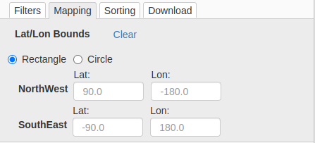

You can specify a **rectangular bounding** by providing the NorthWest and SouthEast coordinates of the rectangle, or by using the draw rectangle feature on the map itself.  

You can specify a **circular bounding** by providing a Latitude/Longitude point with a radius, or by using the draw circle feature on the map itself.

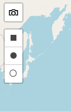

### Sorting Tab

The **Sorting** tab provides the ability to sort your results by multiple fields. 
By default, results are sorted by _Genus_, then _Specific Epithet_, and then by _Date Collected_.  

New rules can be added with the **Add a sort** button. 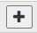  

Remove a rule using the remove sort button. 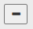  

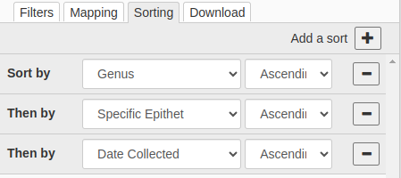

### Download Tab

The **Download** tab allows you to obtain the data in your current result set in Darwin Core Archive (DwC-A) format. 
You must provide a valid email address - in the event you navigate away from the page it will be used to send you a link to the DwC-A file.  

You can run multiple downloads concurrently and they will execute independent of one another. 
When a download is ready, the status will change from **pending** to **Click To Download**.

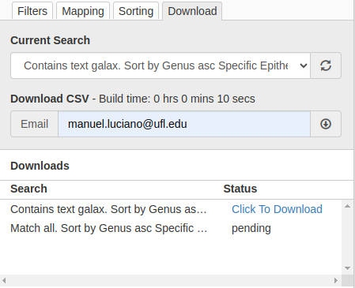  

!!! note "Note that the Build time is a rough estimate and will round to 10 seconds for smaller result sets."

<h5> What is a Darwin Core Archive? </h5>

A **Darwin Core Archive** is a zip file that includes one or more text CSV (comma separated value) files, each with a .txt extension and a descriptor (meta.xml) that contains metadata about the data set that you downloaded (e.g., who provided the data and the format).  

A download that has images or other media associated with it will have two CSV files, one for specimen data and the other describing the media.  

The CSV file can be opened by any text editor or can be imported into a database or spreadsheet. 
!!! note "A modestly sized download (~100,000 records) can be readily opened in software like MS Excel. The easiest way to open a CSV file with Excel is to change the .txt extension to .csv before you open the file."

## Understanding the Map

Any records in the result set that have been georeferenced (i.e., latitude and longitude coordinates are present) are included in the map view.
The map displays results in two styles depending on the number of mapped results.
When the results contain more than 100,000 points they will be displayed as a geohashed heat map.
When the results are 100,000 or less, they are displayed as individual color coded points.

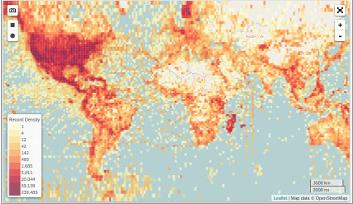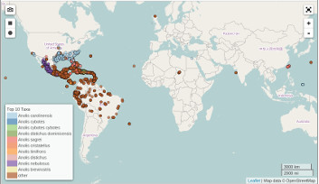

### Clicking on the Map

Both the heat map and point displays are clickable and will display the results in a pop-up box at the location you clicked.
Use the scrollbar and > arrows to navigate the results at that point.

In the case of the heat map, the results pop-up will contain records within the boundary of the geohash (heat) box where you click.
In the case of clicking a point the results displayed will be all those that fall within a radius of the point where you clicked (the radius length varies depending on the zoom level of the map). 

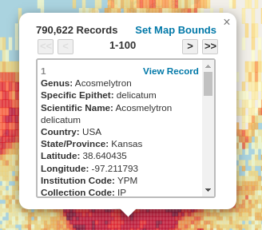

!!! note "Set Map Bounds will set the Mapping tab parameters to the same parameters as the box or point that you clicked on."

### Map Controls

The map provides several controls for further interaction.

 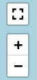

Top left:

- The **Camera Button** allows you to generate a png snapshot of the map. This can take several seconds.
- **Draw a rectangle** allows you to draw a rectangular boundary that will reflect on the _Mapping_ tab. 
- **Draw a circle** allows you to draw a circular boundary that will reflect on the _Mapping_ tab. 

Top right: 

- **Toggle fullscreen**
- **Zoom in**
- **Zoom out**

## Interacting with your results

Results data are displayed in a table below the search form and map sections.
This section displays the total number of results matching your search criteria and gives you four options for displaying the results: 
**List** view, **Label** view, **Media** gallery and the **Recordsets** view.

### List View

The **List** view allows you to customize a table containing data fields that are searchable in iDigBio. 

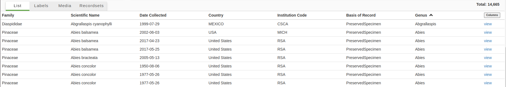

The **Columns** button in the header opens a menu that lets you add or remove field data columns.

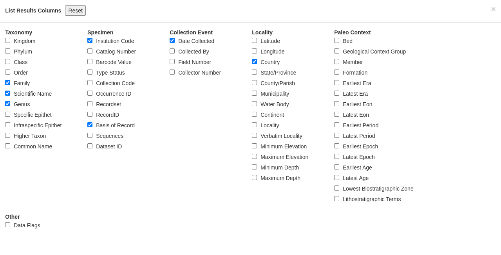  

Clicking the **View** link will open that specimen's [Record Page](#) in a new tab.

!!! note "Click a column header to sort by ascending or descending order on that field. This will be reflected on the Sorting tab."

### Label View

The **Label** view displays a stylized specimen label, with a pre-determined set of information (taxonomy, geography, and collection data) and a thumbnail of a related image when available.

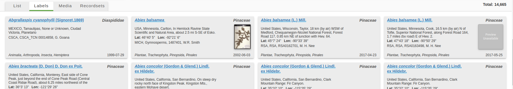

### Media View

The **Media** gallery displays all images and media associated with the specimen record search results. 
Each image contains a pre-determined set of information (taxonomy, collection data) displayed as a label over the image.  

Clicking on the image will open its associated [Media Record](#) in a new tab. 

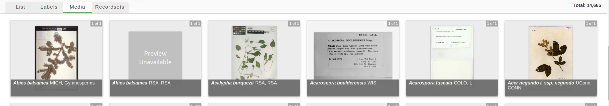

### Recordsets View

The **Recordsets** view provides a list of recordsets and record counts that are present in the search results.  

Clicking on the links in the RecordSet column will open the associated [RecordSet](#) page in a new tab.

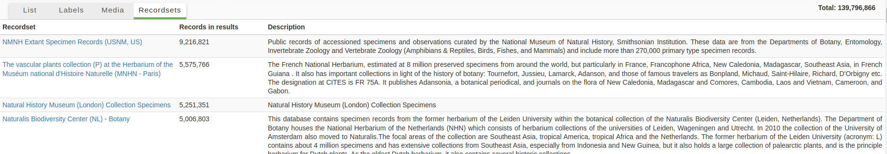

