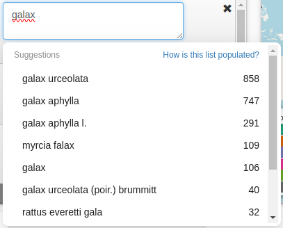

The iDigBio portal provides a drop down menu with suggested search terms.
These suggestions are purely optional - press the enter key to close the drop down. 

##### How is the suggestions list populated?

The list is populated with the top scientific names contained in iDigBio data by count, for your search term. 

!!! warning "Note that suggestions are based on an aggregation of available data and not any particular taxonomic backbone. This is subject to change in the future."
